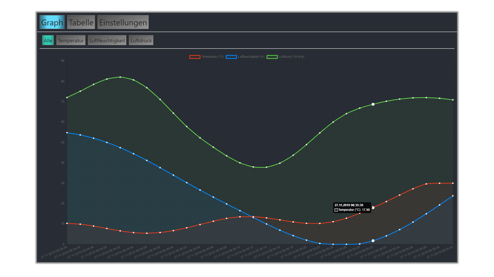
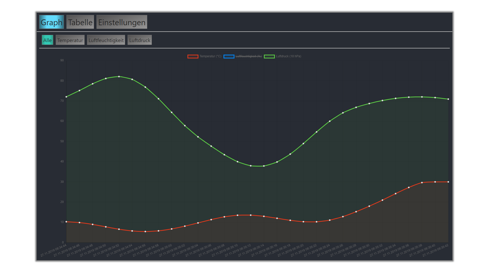
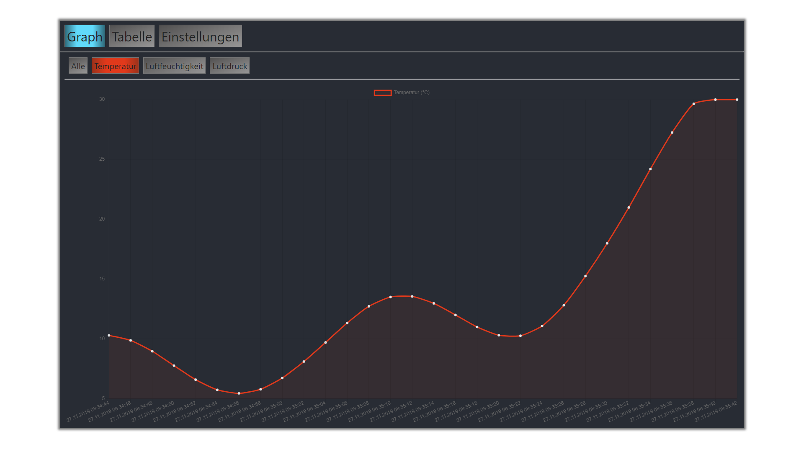
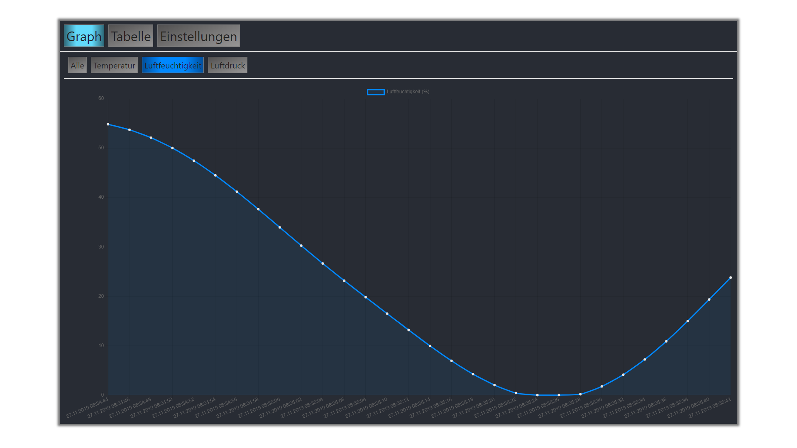
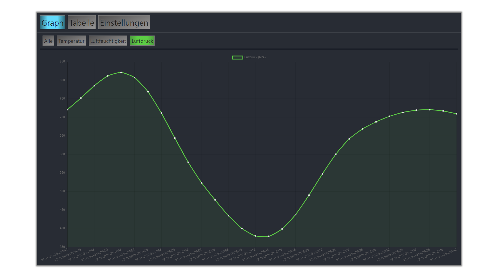
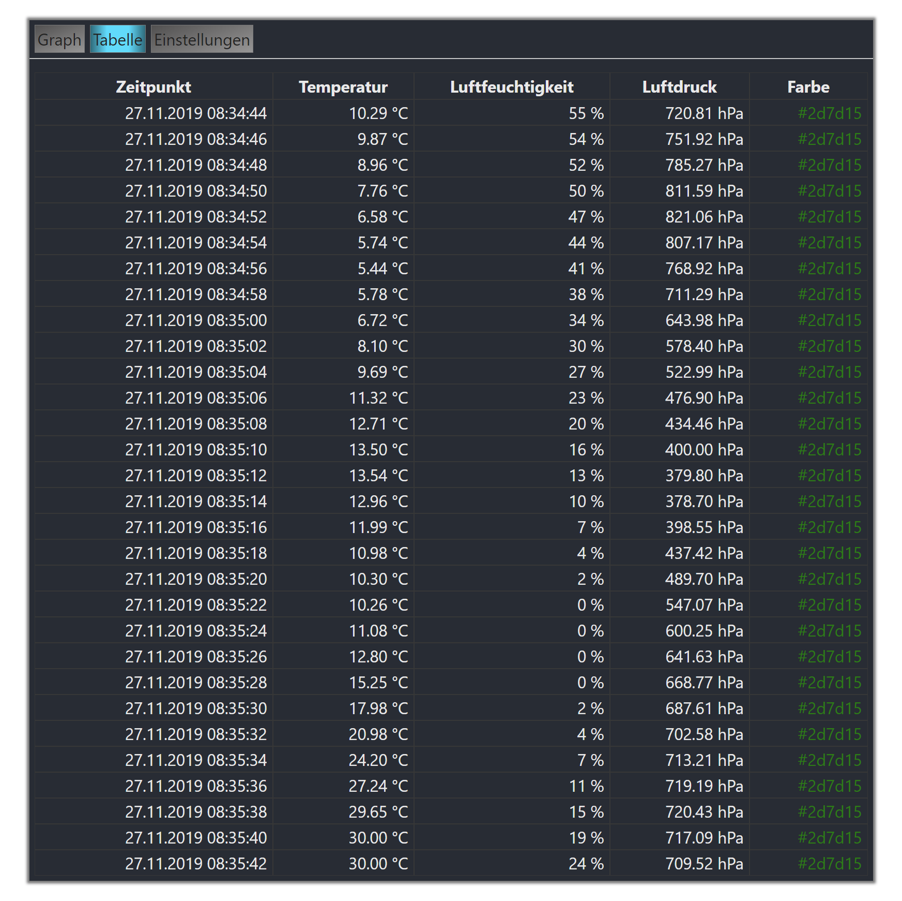
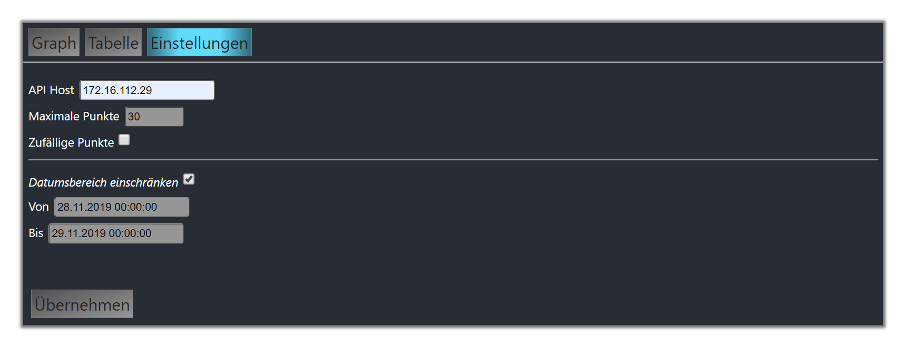

# End-User Documentation

---

## 1. Introduction

This project is a simple weather monitoring service. It measures temperature, humidity and pressure
every 10 seconds and stores these measurements in a database.
It is suited for anybody owning a raspberry pi with a connected Bosch BME280-Sensor via the I²C-interface.

The Weather Monitoring project is provided by Philipp Evermann and Luke Linde,
responsible for the web-backend and -frontend, as well as Pascal Fischer for the actual readout-service.

---

## 2. Installation Instructions

### Prerequisites

- Raspberry Pi with Raspbian (Lite (recommended) or Desktop)
- internet-access
- bash  (installed by default)
- cmake (installed by default)
- make  (installed by default)
- gcc   (installed by default)
- docker         (`curl -fsSL get.docker.com -o get-docker.sh && sh get-docker.sh`)
- docker-compose (``sudo curl -L https://github.com/docker/compose/releases/download/1.18.0/docker-compose-`uname -s`-`uname -m` -o /usr/local/bin/docker-compose``)
- node-js        (`sudo apt install nodejs`)
- npm            (`sudo apt install npm`)

### Project Initialization

1. Open a terminal on the Raspberry Pi or establish a connection over ssh (make sure the user is `pi`)
2. Create a projects directory in the users home and `cd` into it (`mkdir -p ~/projects && cd $_`)
3. Clone the project repository (`svn checkout http://repositoryserver/svn/sensorsystemlinux`)
4. `cd` into the cloned repository (`cd sensorsystemlinux`)

#### Hardware

#### Backend

1. Go to the `web` directory (`cd web`)
2. The are some helper-scripts under `./scripts/`. Make them executable: `chmod +x ./scripts/*`
3. Build the required docker containers: `./scripts/app-rebuild-containers`
4. Start the container: `./scripts/app-start-containers`
5. Once the containers are running, connect to the Pi's IP on port 88 from a web browser  
   Use `ip -4 addr show eth0` to get the Pi's IP address.  
6. Use the database `sensor` by clicking on it on the left
7. Create the required database tables. You can do this by drag'n'dropping the `.sql` files located at 
   `web/data/sql/` or copy their content into the SQL tab of phpmyadmin.  
   Note that `foreign_key_constraints.sql` needs to be executed last.  

#### Frontend

1. Run `./scripts/frontend-dependencies` to install all the JS dependencies.
2. Build the frontend by executing `./scripts/frontend-build`. This will automatically put the built files into the public directory
3. The frontend should now be available on port 80.

#### Sensor

1. Install the required dependencies:
  1. Clone the [MariaDB-C++-Connector-repository](https://github.com/Roslaniec/MariaCpp) from Github to any directory on the raspberry.
  2. Follow the installation-instructions in the [INSTALL.md](https://github.com/Roslaniec/MariaCpp/blob/master/INSTALL.md)
2. Go to the project root and `cd` into `SensorSystem`
3. run `cmake CMakeLists.txt`
4. run `make`
5. change the current directory: `cd ./bin`
6. Start the program with `./SensorSystem`

### Starting and Stopping

- Start the application by running `./scripts/app-start-containers` while being inside the web directory
- Stop it by running `./scripts/app-stop-containers` while being inside the web directory
- Start the sensor by `cd`-ing into SensorSystem and executing `./SensorSystem`
- Stop the sensor with ^C (`CTRL` + `C`)

### Test Data

To test the web part, you can insert some sample values.  
Do so by being in the `web` directory and running `scripts/debug-insert-perlin-data`,
which accepts the amount of points to insert as the first parameter,
and offers a possibility to wait after each inserted point.
Example: `scripts/debug-insert-perlin-data 100 wait`

---

## 3. Product Scope

This sensor system measures current environmental data such as
temperature, humidity and air pressure periodically.
The recorded data can be visualized as graph or table to easily view and analyze
the development of the environment.
You can switch between the visualizations by clicking the respective tabs in
the web-frontend which is reachable at the Pi on port 80. 

The project is split up into three separated microservices:
- An executable program responsible for measuring and storing the data in a database
- A web-frontend to view the data in a web browser
- A web-backend that provides the data to the frontend

The web-backend and all needed services are provided as docker-containers.
To be able to use this sensor system, all services must run simultaneously
(see "2. Installation Instructions - Starting and Stopping").

### Usage

#### Web Interface 

The web interface consists of three sections.

##### The graph

The graph gives the user the ability to look at the trend of the measuring data.
The x-axis represents the timestamps, and the y-axis represents the values of the measure points.
The y-axis scales depending on the maximum and the minimum values of the measurement.  
The graph itself is split up in four sections.

On this section every dataset is shown.  
By hovering over a measure point on one of the lines the point will be highlighted and the value will displayed in a small lable.  
Additionally all other measure points on the same timestamp will be highlighted as well.  
The 'Alle' section also allows to select which datasets are displayed.  

By default, all sets will be displayed. 
To deactivate a certain set, the user just has to click on this specific set in the legend.  
If a set is deactivated the same process will reactivate the set.

The second section displays the temperature at the time of measurement.

The third section displays the humidity at the time of measurement.

The fourth section displays the air pressure at the time of measurement.

##### The table

The second section of the web interface `Tabelle` displays a table that shows the data of each measure point.

The entries in the table are sorted by the time they were measured.

##### Settings

The interface provides the option to configure the basic functionalities of the system.

The following properties can be configured:

| property                   | description |
|----------------------------|-------------|
| API Host                   | address of the measurement system host |
| Maximale Punkte            | amount of measure points the graph and the table will show |
| Random Points              | measure points will be randomized (disables `Datumsbereich einschränken`) |
| Datumsbereich einschränken | graph and table will only show points in a specified time period(disables `Random Points`) |
| Von                        | begin of specified time period (Option only shown if `Datumsbereich einschränken` is enabled) |  
| Bis                        | end of specified time period (Option only shown if `Datumsbereich einschränken` is enabled) |  

To apply changes, the user can either click the button labeled `Übernehmen` or press the `Return` key.
