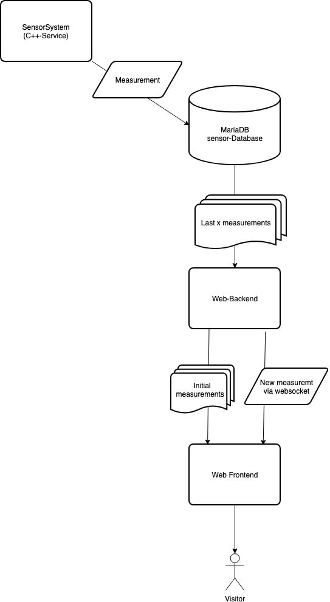
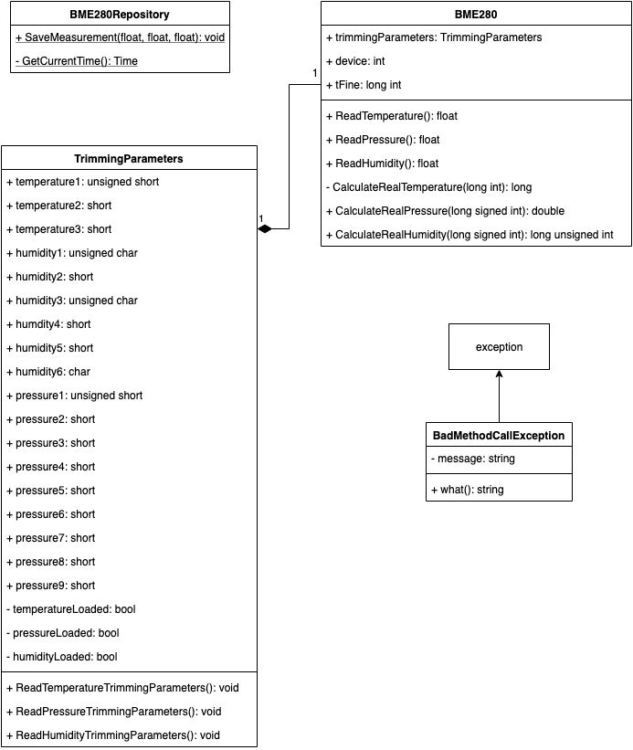
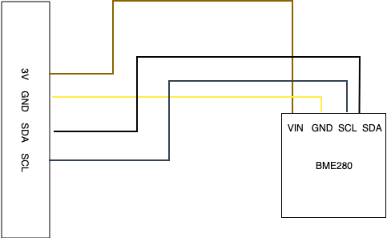

# Technical Documentation

---

## 4. Project Structure

### Directory Structure

As the project is fully modular, its directory structure is very well organized.
Some directories may seem redundant, but they make sense considering the project
is able to grow without re-organizing the structure.

This is an explanation of the important directories and files.

#### SensorSystem

The `SensorSystem` directory contains the C++-Code and all needed files for building the project.
Everything in this directory an it's subdirectories is maintained by Pascal Fischer 

##### cmake

Here you'll find all `find`-CMake-Files for finding external libraries while creating the `makefile` with cmake.

##### src

As the name suggests, this directory contains all C++-header and source files.
To get more information about the classes used, take a look at the UML-diagrams in chapter 5.

The contents of the files in this directory are explained in detail below. Every `.cpp` also has it's own header file,
consisting of the same name but with the fileending `.h`. Header files contain information about classes, for example classes, methods
and fields as well as other included header files. The implementation of the header files can be found in the corresponding
`.cpp`-file.

This documentation wont go into detail about the header files, as they are relatively self explaining.

###### main.cpp
The `main.cpp` contains the main loop and is responsible for starting the readout and sending the data to the repository, which saves them permanently.
The repository could be changed easily if you don't want to save your data in a MariaDB table.

###### BME280.cpp
This class is responsible for the actual data readout of temperature, humidity and pressure. The constructor writes the config registers,
the methods "ReadTemperature", "ReadHumidity" and "ReadPressure" are responsible for reading their corresponding data from the sensors registers, 
passing them to a "CalculateReal"-method. These methods are provided by Bosch and calculate the actual values from the raw data and trimming parameters

###### TrimmingParameters.cpp
The `TrimmingParameters`-class acts as a container, which stores the trimming parameters saved in several registers of the sensor.
As these values do not change, it increases performance to hold these values in memory after reading them the first time.

###### Repository/BME280Repository.cpp
This repository connects to the MariaDB and saves the gathered data to the database table. It uses the MariaDBConfig to change
the login data. The `SaveMeasurement`-method takes the temperature, humidity and pressure and send it to the database using
prepared statements. If any exception occurs it will be sent to stderr.
The method `GetCurrentTime` returns the current datetime as string in the format `Y-m-d H:M:S`.

###### Config/MariaDBConfig.cpp
Using the simpleini-library, this class reads the MariaDb-config from the `mariadb.ini` in the `config` directory and loads it into
memory. It acts as a container and is used in the `BME280Repository`.

#### web

This directory contains the web-frontend and the web-backend.
It has it's own directory structure and notable files.

|File                 |Description|
|---------------------|-----------|
|composer.json        |configuration for composer, which handles php dependencies, autoloading and meta information
|composer.lock        |contains information about each required dependency and its currently used version
|docker-compose.yml   |configuration for docker services used for this project. This file is read by docker-compose which automatically start the containers
|docker-compose.pi.yml|the Pi needs different container images than the test environment due to a different CPU architecture

|Directory   |Description|
|------------|-----------|
|config      |Here are some configurations that the project depends on, such as database credentials,<br/>commands for usage from the CLI, rotes for the frontend and object dependencies.<br/>The main file is `config.php`, which reads the other files and organizes their contents<br/>into an associative array.|
|data        |This directory is for storing data of any kind, such as logs files or database queries.<br/>Currently, there are only a couple of `.sql` files inside the `sql` directory containing<br/>table initialization queries.|
|docker      |Contains specific files for some used docker containers, like nginx and php.<br/>There is a custom configuration for the web server and a `Dockerfile` which is responsible<br/>for a custom php image including some extensions like `xdebug` and `mysql`.|
|module      |Source of the PHP application. It contains a `bootstrap.php`, which serves as the entry point and starts the application.<br/>The source is organized in expandable modules, but currently only contains the `Application` module.
|public      |Root of the frontend web-server.<br/>Contains an entry point to the php application, some resources and compressed JavaScript files.|
|scripts     |Used to store helper scripts for a more user friendly usage.<br/>There are scripts to start and stop the web application, building the frontend and other scripts used for development.|
|vendor      |Storage for PHP dependencies to external libraries required by this application.<br/>It also contains binaries from these libraries as well as an autoloader for PHP classes.<br/>It is automatically created by composer|
|frontend    |The web-frontend is located here, it has it's own directory structure and notable files.<br/>See next section for a detailed explanation|

##### frontend

- `.flowconfig`: required for `flow` to work, even if it's empty
- `package.json`: configuration for npm, which handles js dependencies and meta information
- `package.lock`: contains information about each required dependency and its currently used version


|Directory   |Description|
|------------|-----------|
|node_modules|Not directly belonging to the project.<br/>JavaScript dependencies to external libraries required by the frontend are stored here.<br/>It is automatically created by npm|
|public      |The root directory of the frontend development Web-Server.|
|src         |The source of the frontend JavaScript, which is a React-App.<br/>It consists of classes, components, style, types and helper scripts.|


## 5. Code structure

To get an overview of the whole project, you can take a look at this dataflow-diagram:



### SensorSystem

The following UML-Diagram shows the class structure of the SensorSystem-Project:



#### Classes

|Classname|Description|
|---------|-----------|
|MariaDBConfig|Reads the config data from the file `mariadbconfig.ini` in the `config` directory and serves as a container for the login-data of the server.|
|BME280Repository|Serves as an adapter between the database and the application|
|TrimmingParameters|Reads the trimming parameters from the sensors registers and holds them in memory serving as a container|
|BME280|Responsible for the communication with the sensor|
|BadMethodCallException|An exception class thrown if a method is called at a wrong time, e.g. `ReadPressure()` before `ReadTermperature()`|

#### Methods

##### BME280Repository
- SaveMeaurement: This Method saves the data read from the sensor and normalized to SI-units in the database.
- GetCurrentTime: It gets the current system time and returns it as a time object.

 
##### BME280
- ReadTemperature: This method gets the current temperature raw data from the sensor, passes it to `CalculateRealTemperature()`
and returns the current temperature in °C multiplied by 100.
- ReadPressure: The task of this method is to get get the raw pressure data from the sensor, pass it to `CalculateRealPressure()`
and return it in hPa multiplied by 100
- ReadHumidity: This one does the same as the previous two: It gets the raw humidity data from the sensor, passes it to `CalculateRealHumidity()`
and returns it in percent multiplied by 1024.
- The three `CalculateReal`-Methods: All of those three methods are provided by Bosch in their [documentation](https://www.bosch-sensortec.com/media/boschsensortec/downloads/environmental_sensors_2/humidity_sensors_1/bme280/bst-bme280-ds002.pdf).
They are used to calculate the actual pressure, temperature and humidity, using the raw data and the trimming parameters from the corresponding
registers of the sensor.
 
##### TrimmingParameters:
- ReadTemperatureTrimmingParameters: When called, this method reads the temperature trimming parameters from the sensors registers
and writes them into the temperature-fields of the class.
- ReadPressureTrimmingParameters: This method also reads trimming parameters from the registers and loads them into fields, but it loads the
pressure trimming parameters instead of temperature.
- ReadHumidityTrimmingParameters: As both of the methods above, this one reads the humidity trimming parameters from the sensors registers
and loads them into memory by storing them in the corresponding fields.

##### BadMethodCallException
- what: If this exception is thrown, the `what`-method will be called and the string returned by this method will pre printed as an error message.

##### MariaDBConfig
- MariaDBConfig: The constructor of this class uses a library called "simpleini" to read the config for the MariaDB connection
and stores it in class fields.

### web


The PHP application has one file as an entrypoint, `public/index.php`.
As it is in the `public` directory of the web server,
it includes a bootstrapper from outside the publicly accessible area to avoid exposing code to the outer world.
This bootstrapper differentiates between a FPM (FastCGI Process Manager)
and a CLI (Command Line Interface) context and runs one of two different entry classes.

#### (Cli)Application
 
The class `Application` handles web requests, whereas `CliApplication` processes calls from the CLI.
Both classes have some behaviors in common, as they both have a method named `run`, which starts by reading
the application config and building a dependency container.
Then, they decide what logic should be executed depending on the web request or CLI options, respectively.

The `Application` starts to differ by attaching an error handler named "Whoops",
which is installed from an external library, in a method named `attachWhoops`.
Next, it calls it's method `collectRoutes` to build a list of configured routes, each one with its own handler,
called `Controller`. A route is chosen based on an URI and the HTTP method the request was made with.
If no route was matched, an error is returned to the client.  
Afterwards, the responsible controller for that route is instantiated using the dependency container,
which writes some date into the response data object.  
Finally, the contents of said object is sent to the client.

The `CliApplication` instead builds a list of configured commands and picks a command handler
based on the first option of the CLI call. The handler is also instantiated by the
dependency container and handles further execution.

#### Data Objects

Data objects serve as wrapper for simple data types and encapsulate them into more complex ones.
They also allow for a more strict type-hinting.

Except the `Client`, each data object has a private constructor, meaning they cannot be instantiated
from other classes using `new`. Instead, they have a static method that is responsible for creating an instance.
This can also be used to simulate method overloading, which is not featured in php, by creating multiple methods.

Excluding `Route` and `Client`, each data object implements the `JsonSerializable` interface,
meaning it can be transformed into a JSON compliant representation of its own.

|Data Object|Description|
|-----------|-----------|
|UtcDateTime|Represents a regular DateTime object, but always uses the UTC timezone|
|Client     |Contains a connection for a WebSocket client as well as an identifier for it|
|Route      |Definition for a route that is used in the `Application` class|
|Temperature|Simple representation of a temperature as a float|
|Humidity   |Simple representation of humidity as a float|
|Color      |Consists of three floats each one for a different color chanel (RGB)|
|AirPressure|Simple representation of air pressure as a float|
|Measurement|Summary of a date time, temperature, humidity, color and air pressure using the data objects from above|

#### Controllers

Controllers are responsible to respond to web requests and serve as an entry point for a specific route.
They take the HTTP request and put data in the HTTP response.

`AbstractController` is the base that each concrete controller needs to expand.
It offers methods for retrieving both the request and the response as well as for getting the route that matched.
There's also a helpful method for responding with JSON. The core of a controller is the `handle` method,
which is declared as an abstract one in this class.

|Controller         |Description|
|-------------------|-----------|
|IndexController    |Reads the frontend app `index.html`) and puts it into the response|
|ApiController      |Takes a date range from the request query and uses the `MeasurementService` to respond with a JSON document containing measurements from the database|
|ApiRandomController|Uses the `MeasurementService` to respond with a JSON document containing random generated measurements. The amount of generated measurements is taken from the request query|

The CLI usage of this application also uses controllers, but they differ from the previously described ones.
They expand `AbstractCliController`, which defines the abstract method `handleCli`.
This method takes all the arguments from the CLI call as its only parameter.

Currently, there is only one concrete CLI controller, namely `SocketController`.
This controller builds and `IoServer` from the library `cboden/ratchet` to create a WebSocket server.

## 6. Used Hardware

This project depends on a Bosch BME280, connected to the device via an I²C-interface, e.g. the GPIO-pins of a raspberry pi.
The following illustration shows how to connect the sensor to the GPIO-Pins.



The communication with this device is possible via the I²C-protocol. To use this, you need to install the i2c-tools, which are
pre-installed on the rasperry pi.
`sudo apt install i2c-tools`

The BME280 is reachable at register `0x76`. To test if the sensor is correctly plugged in, you can use the command `sudo i2cdump -y 1 0x76`, which will
show all register values in any successful case.

To enable the actual measurement, it is needed to write to the config registers. The following setup will enable oversampling

|register|value|effect|
|--------|-----|------|
|0xF2    |0x01 |set `humidity` oversampling to `1`|
|0xF4    |0x27 |set `pressure` and `temperature` oversampling to `1`; set sensor into `normal mode`|

The [Bosch-documentation](https://ae-bst.resource.bosch.com/media/_tech/media/datasheets/BST-BME280-DS002.pdf) shows more details about register values.

Data-readout is possible via these registers:

|values     |registers|
|-----------|------|
|temperature|0xFA, 0xFB, 0xFC(bit 7, 6, 5, 4)|
|pressure   |0xF7, 0xF8, 0xF9(bit 7, 6, 5, 4)|
|humidity   |0xFD, 0xFE|

## 7. The hard parts

The most difficult part was to find out the needed registers for reading data from the sensor and how to configure it. It required many hours in reading the sensors documentation
and try and error with cli commands. This resulted in the following code for reading data:

```cpp
SensorSystem::BME280::BME280() {
    // Setting up the connection to the sensor
    device = wiringPiI2CSetup(0x76);
    // Write the config to the config-registers 
    wiringPiI2CWriteReg8(device, 0xF2, 0x01);
    wiringPiI2CWriteReg8(device, 0xF4, 0x27);
    trimmingParameters = new TrimmingParameters();
    // The tFine value saves a fine temperature value which is needed for temperature and humidity calculation
    tFine = nullptr;
}

float SensorSystem::BME280::ReadTemperature() {
    // Read trimming parameters needed for calculating the real temperature
    trimmingParameters->ReadTemperatureTrimmingParameters();
    // Read the values from the temperature registers
    unsigned int readTemperature = wiringPiI2CReadReg8(device, 0xFA) << 12;
    readTemperature += wiringPiI2CReadReg8(device, 0xFB) << 4;

    return (float)CalculateRealTemperature((long int)readTemperature);
}

float SensorSystem::BME280::ReadHumidity() {
    if (tFine == nullptr) {
        throw SensorSystem::BadMethodCallException("Temperature must be read before humidity");
    }

    trimmingParameters->ReadHumidityTrimmingParameters();
    long int readHumidity = bswap_16(wiringPiI2CReadReg16(device, 0xFD);
    long unsigned int realHumidity = CalculateRealHumidity(readHumidity);

    return (float) realHumidity;
}

float SensorSystem::BME280::ReadPressure() {
    trimmingParameters->ReadPressureTrimmingParameters();
    long int readPressure = bswap_16(wiringPiI2CReadReg16(device, 0xF7)) << 4;
    readPressure += (wiringPiI2CReadReg8(device, 0xF9) & 0b11110000) >> 4;

    return (float)CalculateRealPressure(readPressure);
}
```

The constructor initializes the connection to the sensor and writes the setup into the config registers to enable humidity,
pressure and temperature oversampling and enable the measurement off the sensor.

The three `Read`-Methods read the registers containing the raw data and passing it to the corresponding method provided by
Bosch in the documentation of the sensor. These methods return the actual humidity, pressure and temperature in percent,
hPa and °C.

## 8. Open points

The project as it is is almost completely finished, but the optional part of reading out a second sensor to get information
about current brightness or colors was discarded for time reasons.

A nice-to-have feature is probably a filter for a datetime-selection in the web-frontend settings, but this feature is
not completely implemented yet.
