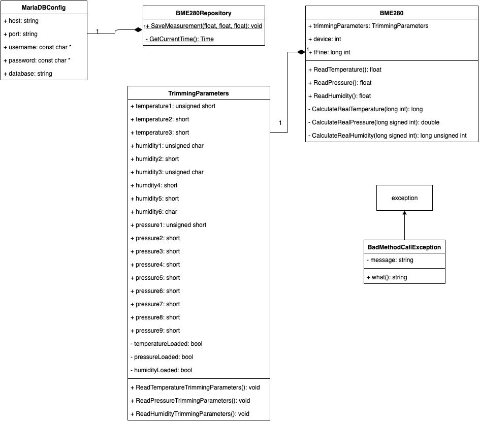
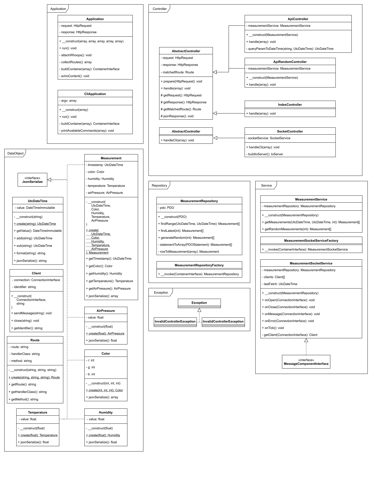

# Technical Documentation

---

## 4. Project Structure

### Directory Structure

As the project is fully modular, its directory structure is very well organized.
Some directories may seem redundant, but they make sense considering the project
is able to grow without re-organizing the structure.

This is an explanation of the important directories and files.

#### SensorSystem

The `SensorSystem` directory contains the C++-Code and all needed files for building the project.

|Directory|Description|
|---------|-----------|
|cmake    |All `find`-CMake-Files for finding external libraries while creating the `makefile` with cmake are stored here|
|src      |Contains all C++-header and source files|

#### web

This directory contains the web-frontend and the web-backend.
It has it's own directory structure and notable files.

|File                 |Description|
|---------------------|-----------|
|composer.json        |configuration for composer, which handles php dependencies, autoloading and meta information
|composer.lock        |contains information about each required dependency and its currently used version
|docker-compose.yml   |configuration for docker services used for this project. This file is read by docker-compose which automatically start the containers
|docker-compose.pi.yml|the Pi needs different container images than the test environment due to a different CPU architecture

|Directory   |Description|
|------------|-----------|
|config      |Here are some configurations that the project depends on, such as database credentials,<br/>commands for usage from the cli, rotes for the frontend and object dependencies.<br/>The main file is `config.php`, which reads the other files and organizes their contents<br/>into an associative array.|
|data        |This directory is for storing data of any kind, such as logs files or database queries.<br/>Currently, there are only a couple of `.sql` files inside the `sql` directory containing<br/>table initialization queries.|
|docker      |Contains specific files for some used docker containers, like nginx and php.<br/>There is a custom configuration for the web server and a `Dockerfile` which is responsible<br/>for a custom php image including some extensions like `xdebug` and `mysql`.|
|module      |Source of the PHP application. It contains a `bootstrap.php`, which serves as the entry point and starts the application.<br/>The source is organized in expandable modules, but currently only contains the `Application` module.
|public      |Root of the frontend web-server.<br/>Contains an entry point to the php application, some resources and compressed JavaScript files.|
|scripts     |Used to store helper scripts for a more user friendly usage.<br/>There are scripts to start and stop the web application, building the frontend and other scripts used for development.|
|vendor      |Storage for PHP dependencies to external libraries required by this application.<br/>It also contains binaries from these libraries as well as an autoloader for PHP classes.<br/>It is automatically created by composer|
|frontend    |The web-frontend is located here, it has it's own directory structure and notable files.<br/>See next section for a detailed explanation|

##### frontend

- `.flowconfig`: required for `flow` to work, even if it's empty
- `package.json`: configuration for npm, which handles js dependencies and meta information
- `package.lock`: contains information about each required dependency and its currently used version

|Directory   |Description|
|------------|-----------|
|node_modules|Not directly belonging to the project.<br/>JavaScript dependencies to external libraries required by the frontend are stored here.<br/>It is automatically created by npm|
|public      |The root directory of the frontend development Web-Server.|
|src         |The source of the frontend JavaScript, which is a React-App.<br/>It consists of classes, components, style, types and helper scripts.|

### Components

The project is split up into three separate microservices:
- An executable program responsible for measuring and storing the data in a database
- A web-frontend to view the data in a web browser
- A web-backend that provides the data to the frontend

// TODO

## 5. Code structure

To get an overview of the whole project, you can take a look at this dataflow-diagram:


### SensorSystem

The following UML-Diagram shows the class structure of the SensorSystem-Project:



### web



The PHP application has one file as an entrypoint, `public/index.php`.
As it is in the `public` directory of the web server,
it includes a bootstrapper from outside the publicly accessible area to avoid exposing code to the outer world.
This bootstrapper differentiates between a fpm (FastCGI Process Manager)
and a cli (Command Line Interface) context and runs one of two different entry classes.

#### (Cli)Application
 
The class `Application` handles web requests, whereas `CliApplication` processes calls from the cli.
Both classes have some behaviors in common, as they both have a method named `run`, which starts by reading
the application config and building a dependency container.
Then, they decide what logic should be executed depending on the web request or cli options, respectively.

The `Application` starts to differ by attaching an error handler named "Whoops",
which is installed from an external library, in a method named `attachWhoops`.
Next, it calls it's method `collectRoutes` to build a list of configured routes, each one with its own handler,
called `Controller`. A route is chosen based on an URI and the HTTP method the request was made with.
If no route was matched, an error is returned to the client.  
Afterwards, the responsible controller for that route is instantiated using the dependency container,
which writes some date into the response data object.  
Finally, the contents of said object is sent to the client.

The `CliApplication` instead builds a list of configured commands and picks a command based on the first option
of the cli call. It too is instantiated by the dependency container and handles further execution.

#### Data Objects

## 6. Used Hardware

This project depends on a Bosch BME280, connected to the device via an I²C-interface, e.g. the GPIO-pins of a raspberry pi.
The following illustration shows how to connect the sensor to the GPIO-Pins.


The communication with this device is possible via the I²C-protocol. To use this, you need to install the i2c-tools, which are
pre-installed on the rasperry pi.
`sudo apt install i2c-tools`

The BME280 is reachable at register `0x76`. To test if the sensor is correctly plugged in, you can use the command `sudo i2cdump -y 1 0x76`, which will
show all register values in any successful case.

To enable the actual measurement, it is needed to write to the config registers. The following setup will enable oversampling

|register|value|effect|
|--------|-----|------|
|0xF2    |0x01 |set `humidity` oversampling to `1`|
|0xF4    |0x27 |set `pressure` and `temperature` oversampling to `1`; set sensor into `normal mode`|

The [Bosch-documentation](https://ae-bst.resource.bosch.com/media/_tech/media/datasheets/BST-BME280-DS002.pdf) shows more details about register values.

Data-readout is possible via these registers:

|values     |registers|
|-----------|------|
|temperature|0xFA, 0xFB, 0xFC(bit 7, 6, 5, 4)|
|pressure   |0xF7, 0xF8, 0xF9(bit 7, 6, 5, 4)|
|humidity   |0xFD, 0xFE|

## 7. The hard parts

The most difficult part was to find out the needed registers for reading data from the sensor and how to configure it. It required many hours in reading the sensors documentation
and try and error with cli commands. This resulted in the following code for reading data:

```cpp
SensorSystem::BME280::BME280() {
    device = wiringPiI2CSetup(0x76);
    wiringPiI2CWriteReg8(device, 0xF2, 0x01);
    wiringPiI2CWriteReg8(device, 0xF4, 0x27);
    trimmingParameters = new TrimmingParameters();
    tFine = nullptr;
}

float SensorSystem::BME280::ReadTemperature() {
    trimmingParameters->ReadTemperatureTrimmingParameters();
    unsigned int readTemperature = wiringPiI2CReadReg8(device, 0xFA) << 12;
    readTemperature += wiringPiI2CReadReg8(device, 0xFB) << 4;

    return (float)CalculateRealTemperature((long int)readTemperature);
}

float SensorSystem::BME280::ReadHumidity() {
    if (tFine == nullptr) {
        throw SensorSystem::BadMethodCallException("Temperature must be read before humidity");
    }

    trimmingParameters->ReadHumidityTrimmingParameters();
    long int readHumidity = bswap_16(wiringPiI2CReadReg16(device, 0xFD);
    long unsigned int realHumidity = CalculateRealHumidity(readHumidity);
    return (float) realHumidity;
}

float SensorSystem::BME280::ReadPressure() {
    trimmingParameters->ReadPressureTrimmingParameters();
    long int readPressure = bswap_16(wiringPiI2CReadReg16(device, 0xF7)) << 4;
    readPressure += (wiringPiI2CReadReg8(device, 0xF9) & 0b11110000) >> 4;

    return (float)CalculateRealPressure(readPressure);
}
```

The constructor initializes the connection to the sensor and writes the setup into the config registers to enable humidity,
pressure and temperature oversampling and enable the measurement off the sensor.

The three `Read`-Methods read the registers containing the raw data and passing it to the corresponding method provided by
Bosch in the documentation of the sensor. These methods return the actual humidity, pressure and temperature in percent,
hPa and °C.

## 8. Open points

The project as it is is almost completely finished, but the optional part of reading out a second sensor to get information
about current brightness or colors was discarded for time reasons.

A nice-to-have feature is probably a filter for a datetime-selection in the web-frontend settings, but this feature is
not completely implemented yet.
